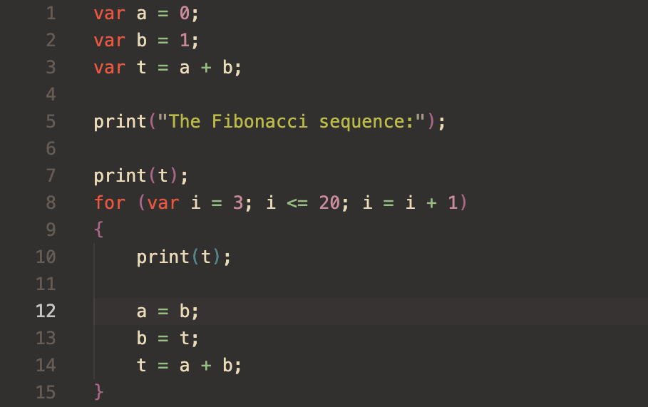

# NIMBLE: Nam's Interpreted Modular Basic Language Engine

This is a super simple interpreter for my NIMBLE programming language

For documentation on the language, visit the [doc](doc/) directory

For example programs, visit the [example](example/) directory

This is still a work in progress.

