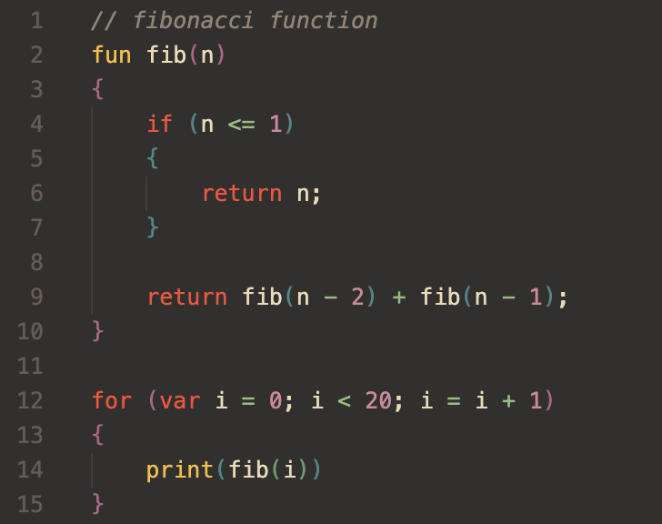

# The NIMBLE Programming Language

NIMBLE (Nam's Interpreted Modular Basic Language Engine) is a dynamically typed, interpreted programming language with C-like syntax. This repository contains the source code for the NIMBLE programming language's interpreter.

I started this project at the beginning of June 2024. I started this project with the goal of learning more about programming language design and practicing my C++ skills. It then gradually became one of my biggest projects yet. 

This was a giant learning project for me. The interpreter is not very optimized and there may be some bugs that I didn't catch, but I'm quite happy with how it turned out. I'll definitely continute working on when I have the time.

# Requirements

Before compilation, you'll need to have these tools installed first:
- [Clang](https://clang.llvm.org/) or [GCC](https://gcc.gnu.org/) (I built this with Clang but GCC works just fine)
- [GNU Make](https://www.gnu.org/software/make/)
- [CMake](https://cmake.org/) (I'm planning to migrate this project to CMake soon)

# Project structure

| Directory | Description |
| --- | --- |
| [doc](doc/) | Documentation |
| [example](example/) | Example programs |
| [include](include/) | Header files |
| [src](src/) | Source code |
| [test](test/) | Test cases |
| [vsc-syntax](vsc-syntax/) | VScode syntax support extension |

# Compiling

If you're using `make`:
- `make compile` to compile the program into the `bin/` directory
- `make run` to run the program
- `make clean` to clean up the object and binary files
- `make test` to run test cases

If you're using `cmake`:
- `mkdir build` and `cd build` to create a `build/` directory and go into it
- `cmake ..` to generate build files
- `make` to compile
- `make clean_all` to clean up the `build/` directory

# Documentation

You can find the documentation in the [doc](doc/) directory. You can also learn about the syntax of the language through example programs found in the [example](example/) directory.
