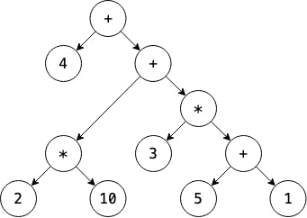

# Parser

The parser will take the list of tokens generated from the lexer and create an abstract syntax tree (AST) out of those tokens.

## Defining the AST

A way to implement the precedence of operations is by using a tree. We can use post-order traversal to work our way from the bottom of the tree up, evaluating every operations in the correct order.



The tree representation needs to match the grammatical structure of the language. So we need to get precise with the language's syntactic grammatical structure.

NIMBLE's syntactic grammar is going to be utilizing the [Chomsky hierarchy](https://en.wikipedia.org/wiki/Chomsky_hierarchy). You can check out the grammar rule of the language [here](grammar.md).

## Parser

Syntax trees aren't homogenous. There are many different types of expressions that we would need to consider (Eg. Unary expressions contain 1 operand, binary expressions contain 2 operands, etc). So I created a base expression structure that other types of expressions can inherit from. These expression subclasses will have different fields for nonterminals specific to that rule.

```cpp
struct Expr
{
    virtual ~Expr() = default;
    virtual std::any accept(ExprVisitor& visitor) = 0;
};

struct UnaryExpr : Expr, public std::enable_shared_from_this<UnaryExpr>
{
    const Token op;
    const std::shared_ptr<Expr> right;

    UnaryExpr(Token op, std::shared_ptr<Expr> right);
    std::any accept(ExprVisitor& visitor) override;
};
```

> Note: I used struct here as it enables all the methods and fields in the class to be public, which is very useful in this case.

I utilized the `enable_shared_from_this` object from the memory library which allows me to reference to the current expression object using shared pointers. Shared pointers help with memory management and reduce the possibility of memory leaks and other memory issues, which is vital to a programming language.

In the unary expression struct that I used as an example, any substructs that represents an expression is typed with a shared pointer to the expression struct. This does help with readability.

These expression structs exists to facilitate communication between the parser and interpreter. As a result, they don't actually do anything other than saving data.

## Expression structs

Let's talk about each of the expression structs and what they do.

### Binary expressions

This struct will take in an operator token and 2 different expressions, left and right, as it needs to evaluate expressions with 2 different operands.

```cpp
struct BinaryExpr : Expr, public std::enable_shared_from_this<BinaryExpr>
{
    const std::shared_ptr<Expr> left;
    const Token op;
    const std::shared_ptr<Expr> right;

    BinaryExpr(std::shared_ptr<Expr> left, Token op, std::shared_ptr<Expr> right);
    std::any accept(ExprVisitor& visitor) override;
};
```

### Unary expressions

This struct will take in an operator token and an expression, right, as it needs to evaluate expressions with a single operand (like `-1`)

```cpp
struct UnaryExpr : Expr, public std::enable_shared_from_this<UnaryExpr>
{
    const Token op;
    const std::shared_ptr<Expr> right;

    UnaryExpr(Token op, std::shared_ptr<Expr> right);
    std::any accept(ExprVisitor& visitor) override;
};
```

### Grouping expressions

This struct will take in a single expression. This single expression has been grouped inside a pair of parentheses.

```cpp
struct GroupingExpr : Expr, public std::enable_shared_from_this<GroupingExpr>
{
    const std::shared_ptr<Expr> expression;

    GroupingExpr(std::shared_ptr<Expr> expression);
    std::any accept(ExprVisitor& visitor) override;
};
```

### Literal expressions

This struct will take in a value of any type (hence the `std::any`). This represents the literal values.

```cpp
struct LiteralExpr : Expr, public std::enable_shared_from_this<LiteralExpr>
{
    const std::any value;

    LiteralExpr(std::any value);
    std::any accept(ExprVisitor& visitor) override;
};
```

## Syntax tree execution order

The interpreter and parser can't really use a bunch of if's and else's to evaluate which expression belong to which expression struct, it would be too slow, plus it scales horribly. So a pattern that I utilized for this task is called the [Visitor pattern](https://en.wikipedia.org/wiki/Visitor_pattern). 

```cpp
struct ExprVisitor
{
    virtual ~ExprVisitor() = default;
    virtual std::any visitAssignExpr(std::shared_ptr<AssignExpr> expr) = 0;
    virtual std::any visitBinaryExpr(std::shared_ptr<BinaryExpr> expr) = 0;
    virtual std::any visitGroupingExpr(std::shared_ptr<GroupingExpr> expr) = 0;
    virtual std::any visitLiteralExpr(std::shared_ptr<LiteralExpr> expr) = 0;
    virtual std::any visitUnaryExpr(std::shared_ptr<UnaryExpr> expr) = 0;
    virtual std::any visitVarExpr(std::shared_ptr<VarExpr> expr) = 0;
    virtual std::any visitLogicalExpr(std::shared_ptr<LogicalExpr> expr) = 0;
    virtual std::any visitCallExpr(std::shared_ptr<CallExpr> expr) = 0;
    virtual std::any visitFunctionExpr(std::shared_ptr<FunctionExpr> expr) = 0;
    virtual std::any visitGetExpr(std::shared_ptr<GetExpr> expr) = 0;
    virtual std::any visitSetExpr(std::shared_ptr<SetExpr> expr) = 0;
    virtual std::any visitThisExpr(std::shared_ptr<ThisExpr> expr) = 0;
    virtual std::any visitSuperExpr(std::shared_ptr<SuperExpr> expr) = 0;
    virtual std::any visitListExpr(std::shared_ptr<ListExpr> expr) = 0;
    virtual std::any visitSubscriptExpr(std::shared_ptr<SubscriptExpr> expr) = 0;
};
```

We have this visitor class for expressions that allow us to evaluate each expression by visiting the correct expression struct based on its type of expression.

Each visit methods are an operation that can be performed on the expression based on the type of the current expression. There's a method for each of the available expressions in the language. Each expression structs have a method called `accept()`, which is used to the expression to the correct method on the visitor based on its type.

When an expression needs to be processed, the expression's `accept()` method is called and the expression itself is passed into the visitor for the operation that needs to be executed. 

This is uses [dynamic dispatch](https://en.wikipedia.org/wiki/Dynamic_dispatch) on the expression class to select the appropriate method on the visitor class. By executing the correct visitor method for each expresison structs, we can correctly choose what to do for each different expressions.

## Recursive descent parsing

[Recursive descent](https://en.wikipedia.org/wiki/Recursive_descent_parser) is employed as our grammar rules are recursive. This allows us to form a tree data structure called a syntax tree. It walks "down" the grammar, from high to low precedence (Eg. equality has a low precedence and unary has a high precedence).

This parser technique starts from the top grammar rule and works its way down into nested subexpressions until it reaches the leaves of the tree.

```cpp
class Parser
{
    const std::vector<Token>& tokens;
    int current = 0;
    int loop_depth = 0;
}
```

The parser takes in a flat input sequence of tokens and use `current` to point to the next token to be parsed. The `loop_depth` keeps track of how many enclosing loops there is, it enables *break* statements.

The parser will have a function for each of the grammar rule, and the functions will expand to the rules with higher precedence than they are. The parser will start with the `expression` rule.

```cpp
std::shared_ptr<Expr> Parser::expression()
{
    return assignment();
}
```

The `expression()` function will recursively descent and call higher precedence rules, until it reaches the rule with the highest precedence: `primary()`, which works just like the grammar rule specified.

```cpp
std::shared_ptr<Expr> Parser::primary()
{
    if (match(FALSE))
        return std::make_shared<LiteralExpr>(false);

    if (match(TRUE))
        return std::make_shared<LiteralExpr>(true);

    if (match(NIL))
        return std::make_shared<LiteralExpr>(nullptr);
        
    if (match(NUMBER, STRING))
        return std::make_shared<LiteralExpr>(previous().literal);

    if (match(IDENTIFIER))
        return std::make_shared<VarExpr>(previous());

    if (match(FUN))
        return function_body("function");

    if (match(THIS))
        return std::make_shared<ThisExpr>(previous());

    if (match(LEFT_BRACKET))
        return list_expression();

    if (match(SUPER))
    {
        Token keyword = previous();
        consume(DOT, "Expected '.' after 'super'");
        Token method = consume(IDENTIFIER, "Expected superclass method name");
        return std::make_shared<SuperExpr>(std::move(keyword), std::move(method));
    }

    if (match(LEFT_PAREN))
    {
        std::shared_ptr<Expr> expr = expression();
        consume(RIGHT_PAREN, "Expect ')' after expression");
        return std::make_shared<GroupingExpr>(expr);
    }

    throw error(peek(), "Expected an expression");
}
```

## Parser state and synchronization

The parser's state (which rule it is currently parsing) is not stored explicitly in the fields of the parser. The parser will use C++ call stack to track what rule the parser is on. Each rule being parsed is a call frame on the stack. In order to reset that state, we need to clear out those call frames.

When we want to synchronize, we throw a parse error. Higher up in the function for the grammar rule we're synchronizing to is where we catch it. We synchronize on statement boundaries, also where we catch the exception. After the exception is caught, the parser is in the correct state. Then we synchronize the tokens. The tokens need to be discarded at the beginning of the next statement. So if the next token is a `for`, `if`, `return`, `var`, etc, then that means we're about to start a statement. And when we finish a statement is when we usually have a semicolon.

If we reaches a parse error, we synchronize. When this works, that means we have discarded tokens that would've caused cascaded tokens. Then right after that, we start parsing the rest of the file starting at the next statement.


